# Latest AI SQL Generator Curated List (Including Performance Comparison)

Your data analysts spend hours writing complex SQL queries while business teams wait days for simple reports, and every syntax error means more delays debugging obscure database documentation. Traditional SQL requires mastering arcane syntax that hasn't changed since the 1970s, creating bottlenecks preventing non-technical teams from accessing data they need for decisions. AI-powered text-to-SQL tools eliminate this friction by converting plain English questions into optimized database queries in seconds. Whether you're a data analyst accelerating workflow, a business user needing instant insights, or a developer building data-driven applications, modern natural language to SQL converters deliver accurate queries without memorizing JOIN syntax or WHERE clause logic.

## **[Text2SQL.ai](https://www.text2sql.ai)**

Industry-leading LLM accuracy generating SQL from 256,000+ satisfied users.

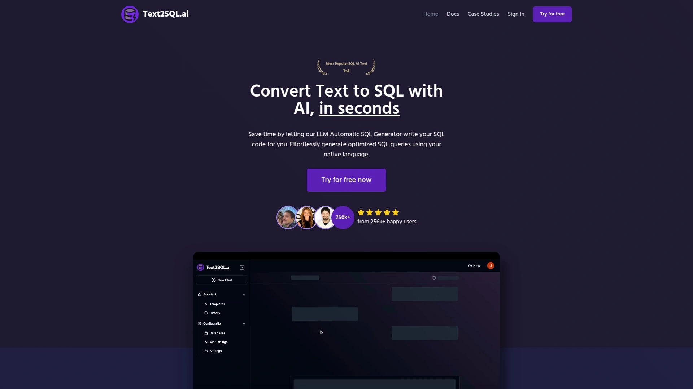

Text2SQL.ai transforms natural language instructions into optimized SQL queries across all major database platforms including MySQL, PostgreSQL, Microsoft SQL Server, Oracle PL/SQL, and MariaDB. The platform serves over 256,000 happy users who trust it for instant query generation eliminating hours of manual coding. You describe what data you need in plain language—"Show me all customers who made a purchase in the last 30 days"—and receive production-ready SQL within seconds that executes correctly on first try according to user testimonials. The schema integration feature dramatically improves accuracy by allowing you to add your specific database tables, columns, and relationships so AI crafts precise queries perfectly matching your data structure. This context awareness produces optimized SQL code ready to use without manual edits or corrections, saving substantial time compared to generic SQL generators lacking schema knowledge. Beyond generation, Text2SQL.ai functions as your personal SQL AI assistant answering questions about everything SQL-related, providing fast results within seconds rather than waiting for data analysts or spending hours on complex queries yourself. The follow-up conversation capability lets you refine queries iteratively until results satisfy your exact requirements. Public API integration enables building custom SQL AI tools incorporating Text2SQL.ai's generation capabilities into your own applications. Free trial offers 20 requests testing all features before committing, with paid plans unlocking unlimited usage. Multi-language support generates queries from text descriptions in various languages beyond English. The platform handles SQL optimization, error fixing, and plain-text explanations helping you understand query logic. Best suited for data analysts needing productivity acceleration, business users wanting self-service data access without SQL knowledge, developers building data applications requiring natural language interfaces, and organizations seeking to democratize data access across non-technical teams. Industry recognition includes Cybersecurity Breakthrough Award Winner 2021, demonstrating trusted security alongside functionality.

## **[AI2sql](https://ai2sql.io)**

Comprehensive SQL toolkit with Text2SQL, optimization, debugging, and learning features.

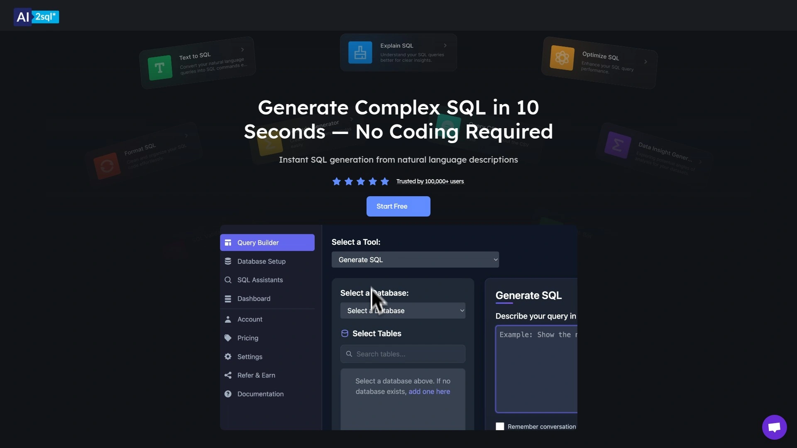

AI2sql delivers complete SQL workflow automation through natural language to SQL conversion, query optimization, error debugging, and educational explanations helping users master database skills. The platform supports MySQL, PostgreSQL, BigQuery, Snowflake, and more with cross-database compatibility ensuring generated queries work regardless of your specific database engine. Natural language interface accepts plain English descriptions like "Show monthly sales by region" returning optimized SQL code instantly, cutting query-writing time by approximately 70% according to performance metrics. Error debugging feature analyzes pasted queries identifying syntax issues and suggesting performance optimizations, functioning like having an expert SQL developer reviewing your code. Learning mode provides educational value by explaining AI-generated queries, teaching users complex concepts like joins, CTEs, and window functions through practical examples they can study. Integration capabilities work alongside BI tools like Tableau and Power BI streamlining data pipelines. Beginner-friendly design particularly helps Excel users transitioning to SQL, removing intimidation barriers preventing adoption. Free tier available with paid plans starting at $15 monthly making it accessible for individual users and small teams. The combination of generation, optimization, and education differentiates AI2sql from pure generation tools, providing comprehensive support throughout SQL development lifecycle. Best for data analysts wanting to accelerate workflows while improving code quality, beginners learning SQL through AI-assisted examples, and teams needing versatile tool handling multiple SQL-related tasks beyond just generation.

## **[BlazeSQL](https://www.blazesql.com)**

AI-native BI platform creating dashboards and visualizations automatically from queries.

BlazeSQL extends beyond query generation into complete AI-powered business intelligence by automatically creating stunning dashboards from your data with just a few clicks after generating SQL. The platform reads your database schema guaranteeing precise, ready-to-execute SQL queries optimized for your specific data structure rather than producing generic queries requiring manual adjustment. In-memory computing and automated query optimization deliver faster execution speeds particularly valuable for large datasets. Privacy-first architecture processes data locally on your device ensuring sensitive information never leaves your environment—critical advantage for enterprises handling confidential data under compliance requirements. Desktop version keeps query results strictly local and private, with AI only accessing metadata like table and column names rather than actual data values. Multi-database support spans MySQL, PostgreSQL, Snowflake, BigQuery, Redshift, and Microsoft SQL Server accommodating diverse technology stacks. The dynamic dashboard editor enables personalizing visualizations matching specific reporting needs. Setup completes in under one minute—enter database credentials, select tables you want to use, and start chatting with your AI data analyst immediately. Enterprise-level security features meet stringent corporate requirements. Best for business analysts needing instant visualizations alongside queries, marketing teams wanting to query campaign data and visualize performance metrics quickly, and enterprises prioritizing data privacy while seeking AI-powered analytics. The visualization capabilities distinguish BlazeSQL from text-only SQL generators, delivering complete insight generation workflow.

## **[Chat2DB](https://chat2db.ai)**

AI SQL client supporting 24+ databases with visual ER diagrams and dashboards.

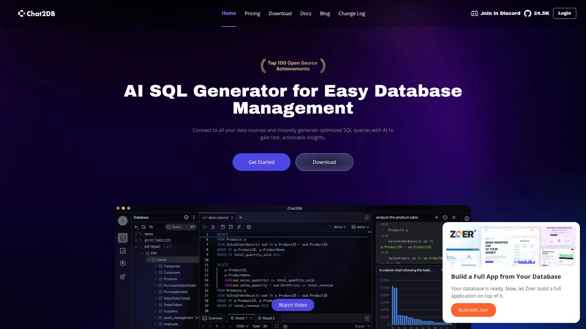

Chat2DB operates as comprehensive AI-powered SQL client simplifying database management through natural language query generation combined with robust visual tools. Support for 24+ relational and non-relational databases including MySQL, Redis, MongoDB, PostgreSQL, and Oracle provides exceptional versatility handling diverse data infrastructure. Visual tools like ER diagrams help understand database relationships at a glance, while customizable dashboards visualize data meaningfully for different stakeholder needs. One-click SQL error fixes accelerate debugging by automatically detecting and correcting syntax issues that typically require manual troubleshooting. AI-assisted analysis generates insights beyond just returning raw query results, helping identify trends and patterns in data. Code generation from schemas creates boilerplate SQL saving time on repetitive tasks. Strong data privacy measures with local query processing ensure sensitive data stays within your environment rather than sending to external servers. Open-source transparency allows examining code and verifying security claims, building trust with security-conscious organizations. The AI-driven query suggestions recommend relevant queries based on user input patterns, learning from your workflow to improve recommendations over time. Schema-aware customization adapts to your specific database including tables, columns, and data types for more accurate query generation. Best for developers managing multiple database types across projects, organizations with mixed database infrastructure requiring unified interface, and teams wanting comprehensive database management beyond just query generation. The combination of AI generation with traditional database client functionality creates versatile tool replacing multiple specialized applications.

## **[Defog.ai](https://defog.ai)**

Enterprise-grade fine-tuned LLM with SQLCoder outperforming GPT-3.5 on SQL generation.

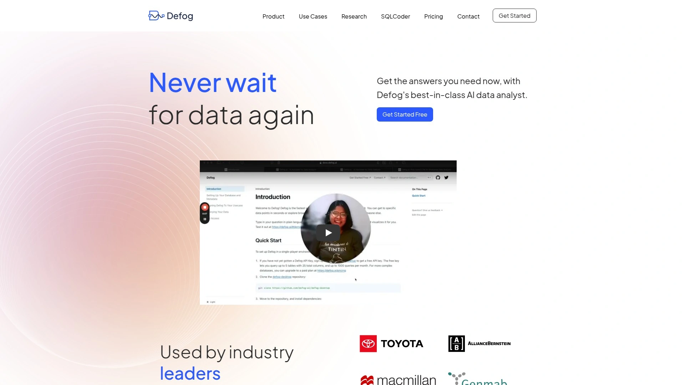

Defog.ai powers enterprise data analysis through SQLCoder, their open-source state-of-the-art large language model specifically fine-tuned for converting natural language to SQL queries. Performance benchmarks show SQLCoder outperforms GPT-3.5-turbo on SQL generation accuracy while running as smaller 15B parameter model, demonstrating specialized training beats general-purpose LLMs for domain-specific tasks. Deterministic results consistently return same answer every time for given question, ensuring reliability for business-critical queries where consistency matters. Self-hostable deployment option allows running Defog 100% locally in your environment, satisfying stringent security and privacy requirements preventing cloud-based AI solutions. Multi-step reasoning handles complex, multi-faceted questions providing comprehensive step-by-step answers enabling deeper insights impossible with simple query generation. Statistical analysis capabilities explore trends, correlations, and patterns without needing specialized statistical software. No-code alignment feature adjusts AI to your preferences and business logic without writing code, customizing behavior through guided teaching that makes system smarter over time. Dynamic feedback adaptation learns from corrections in real-time, adjusting responses to better match expectations with each interaction. Database readiness suggestions provide automated recommendations improving database metadata to maximize Defog's effectiveness. API access enables integrating Defog into custom applications and workflows. Best for enterprises requiring highest accuracy and security standards, data science teams needing advanced analytical capabilities beyond query generation, and organizations wanting self-hosted AI preventing data leaving private infrastructure. The open-source SQLCoder model provides transparency and customization options unavailable from proprietary alternatives.

## **[Sequel](https://sequel.sh)**

Complete AI business intelligence platform executing queries and returning real-time insights.

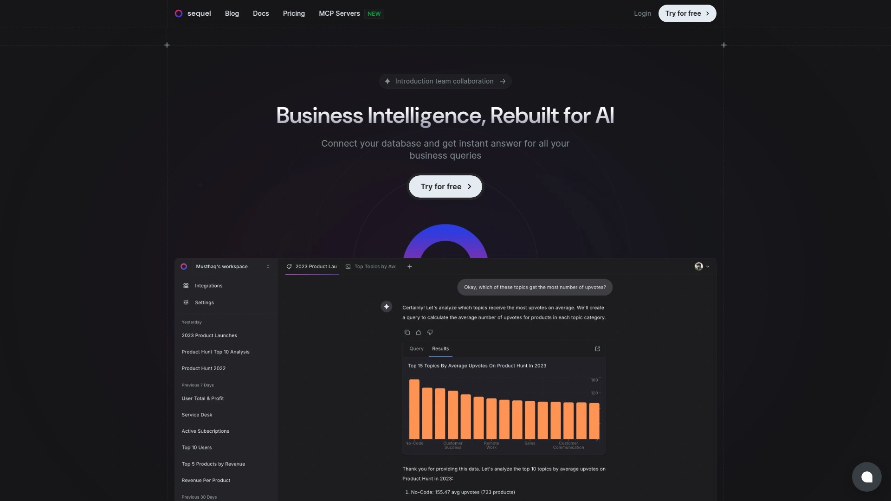

Sequel functions as comprehensive AI business intelligence platform translating natural language into optimized SQL queries, executing them on your live database, and returning insights in real time—often within seconds of asking questions. The platform serves both technical and non-technical users by reducing need for specialized database query skills, democratizing data access across organizations. Charts and graphs generate automatically from data simply by asking, eliminating need for separate visualization tools or manual chart building. Insights and suggestions from analyzing queried data help identify trends and opportunities you might miss reviewing raw results. Wide database support includes PostgreSQL, MySQL, and SQLite covering most common database engines. Security best practices ensure safe and secure querying protecting sensitive data while maintaining accessibility. The conversational interface maintains context across multiple questions, allowing follow-up queries that build on previous results without re-explaining context each time. Real-time execution means no waiting for reports or scheduled queries—answers appear immediately enabling faster decision-making. Best for business teams needing instant data insights without involving developers, executives wanting quick answers to business questions without technical barriers, and organizations seeking to reduce bottlenecks caused by data analyst dependencies. The end-to-end workflow from question to insight positions Sequel beyond pure SQL generation into complete self-service analytics.

## **[EverSQL](https://www.eversql.com)**

Specialized SQL optimizer monitoring and improving query performance automatically.

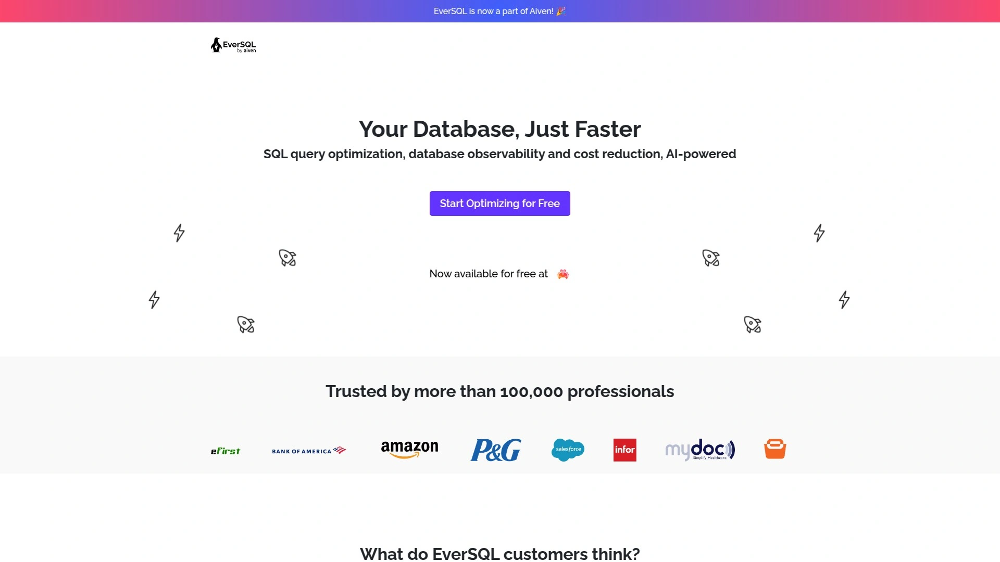

EverSQL focuses specifically on SQL optimization rather than generation, using AI to analyze and improve existing query performance. Over 100,000 engineers use EverSQL to monitor and optimize SQL queries online, demonstrating broad adoption by performance-conscious developers. The platform functions as SQL optimizer for PostgreSQL and MySQL databases identifying inefficiencies and suggesting specific improvements. Automated optimization recommendations explain exactly which changes will improve performance and why, educating users about best practices while fixing immediate problems. Online monitoring capabilities track query performance over time identifying degradation before it impacts users. The specialization in optimization rather than generation fills complementary role to text-to-SQL tools—you generate queries with other tools then optimize them with EverSQL for production deployment. Best for database administrators managing performance at scale, developers wanting to learn optimization techniques through AI guidance, and organizations where query performance directly impacts user experience or operational costs. The focused approach delivers deeper optimization capabilities than general-purpose SQL tools offering optimization as secondary feature.

## **[Outerbase](https://www.outerbase.com)**

Modern database interface with AI-powered editor and automatic chart generation.

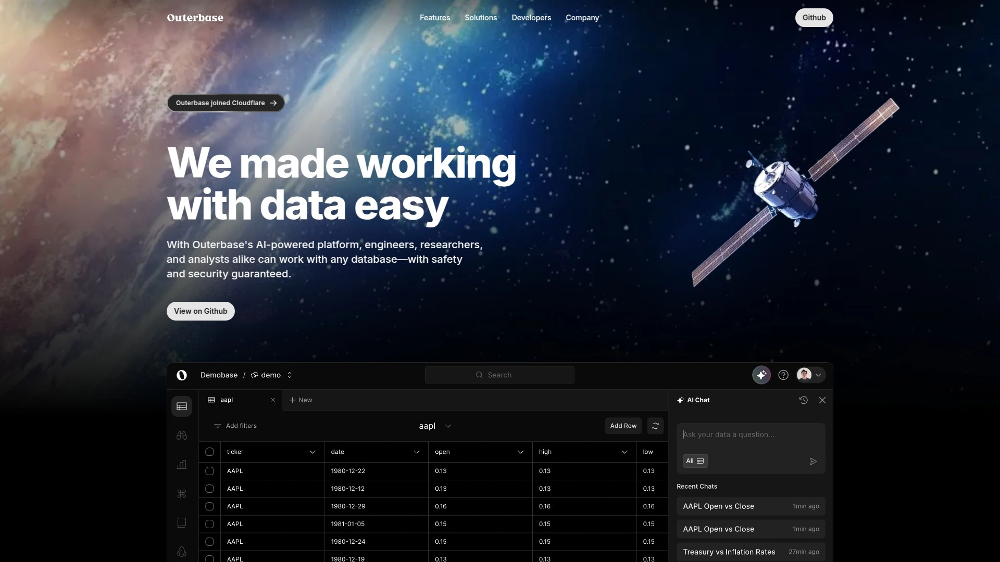

Outerbase provides modern database interface designed to make interacting with data delightful through AI assistance, automatic formatting, and custom theming. The AI-powered query builder helps write queries through intelligent suggestions and mistake fixing, reducing syntax errors that plague manual query writing. Automatic formatting ensures queries remain readable regardless of who writes them, standardizing code style across teams. Custom theming allows personalizing interface matching your preferences or company branding. Transform data into stunning visualizations automatically with built-in chart generation eliminating need for exporting to separate BI tools. The platform emphasizes user experience alongside functionality, making database work feel less like a chore. Best for teams wanting modern, aesthetically pleasing database interface, developers who appreciate well-designed tools improving daily workflow satisfaction, and organizations where data work should be accessible and enjoyable rather than purely utilitarian. The focus on interface design and user experience differentiates Outerbase from purely functional database tools.

## **[SQLAI.ai](https://www.sqlai.ai)**

Free comprehensive SQL toolkit handling generation, optimization, validation, and explanation.

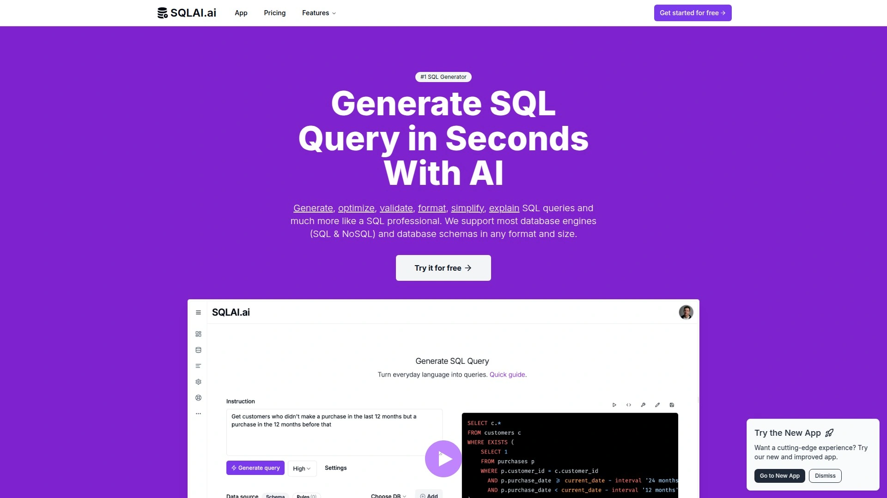

SQLAI.ai delivers complete SQL workflow support through AI-powered tools for generating, optimizing, validating, formatting, simplifying, and explaining SQL queries. Trusted by more than 100,000 professionals worldwide, the platform has proven its reliability and usefulness across diverse use cases. SQL generator transforms everyday language instructions into simple or complex SQL queries including NoSQL with high accuracy, accepting instructions in any language not just English. Optimization tool uses innovative step-by-step process letting you decide exactly which optimization suggestions to apply, giving granular control over performance improvements. Syntax validator scans queries for errors and suggests fixes with explanations ensuring you understand what went wrong and why. Simplification feature removes redundant patterns, unused JOINs, and non-necessary clauses making queries less error-prone and easier to understand. Formatting tool improves readability for yourself and team members. Query explanation provides detailed breakdown with summary and visualized results helping learn from examples. Migration tool helps convert queries between different SQL dialects. The comprehensive free tier makes all functionality accessible without payment barriers. Best for professionals wanting complete SQL toolkit in single platform, learners using AI-generated queries as educational examples, and teams needing standardized query quality across members with varying SQL skill levels. The breadth of features beyond generation provides value throughout entire SQL development and maintenance lifecycle.

## **[Supabase AI Assistant](https://supabase.com)**

Integrated database management AI providing schema design, RLS policies, and function support.

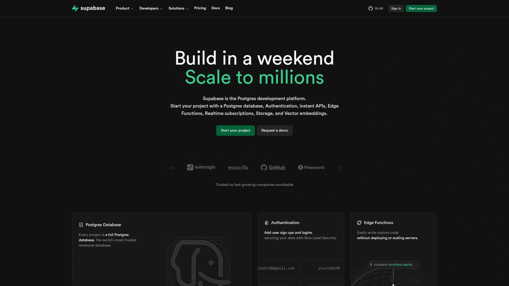

Supabase AI Assistant integrates directly into Supabase Dashboard improving database management experience through context-aware AI support. Enhanced query writing provides precise suggestions based on your actual schema rather than generic SQL recommendations. Error debugging identifies and resolves SQL errors directly within SQL Editor eliminating context-switching to external tools. Data insights discovery executes queries using natural language and displays results in clear format. RLS (Row Level Security) policies management creates and modifies security rules according to requirements through conversational interface. Functions and triggers support helps suggest, create, or update Postgres functions and triggers. Schema design assistance guides structuring databases and generating necessary SQL queries. The AI awareness of your specific database context means suggestions and generated code match your exact setup rather than requiring adaptation. Diff view for AI changes visualizes modifications similar to Git diffs, allowing accepting or rejecting suggestions granularly. Real-time assistance provides instant feedback and recommendations while working on specific tables. Best for Supabase users wanting AI assistance without switching tools, developers building Postgres-based applications needing context-aware help, and teams using Supabase wanting to accelerate development through integrated AI. The tight integration with Supabase platform provides contextual intelligence unavailable from standalone SQL tools.

## **[QueryGPT (Uber)](https://www.uber.com)**

Uber's internal natural language to SQL solution enhancing enterprise productivity.

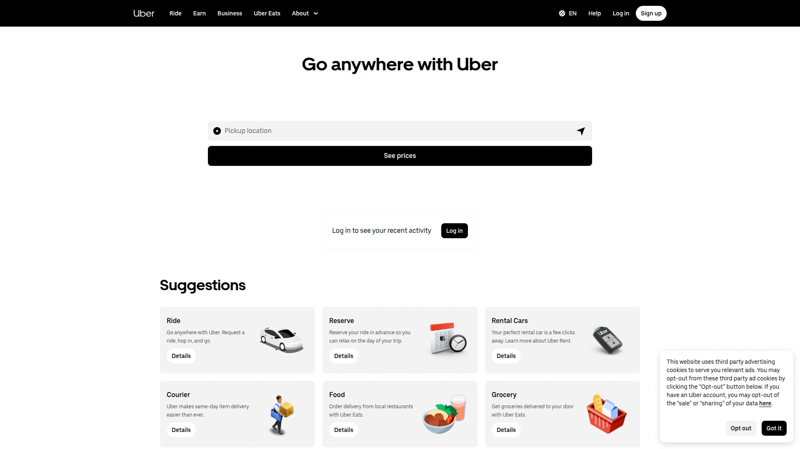

QueryGPT represents Uber's approach to bridging the gap between data accessibility and SQL expertise by enabling users to generate SQL queries through natural language prompts. Developed internally at Uber to significantly enhance productivity across their massive data infrastructure, QueryGPT demonstrates how major tech companies solve text-to-SQL challenges at enterprise scale. The tool aims to democratize data access within Uber by allowing non-technical users to extract insights without learning complex SQL syntax. While primarily internal tool rather than public product, Uber's published information about QueryGPT provides insights into enterprise requirements and implementation approaches for similar solutions. Best reference point for understanding how large technology companies approach natural language to SQL challenges, demonstrating patterns and practices applicable to enterprise deployments. The case study value helps organizations planning similar internal tools understand requirements, challenges, and benefits at scale.

## **[SQL Translator (Open Source)](https://github.com/whoiskatrin/sql-translator)**

Free open-source tool converting between SQL and natural language bidirectionally.

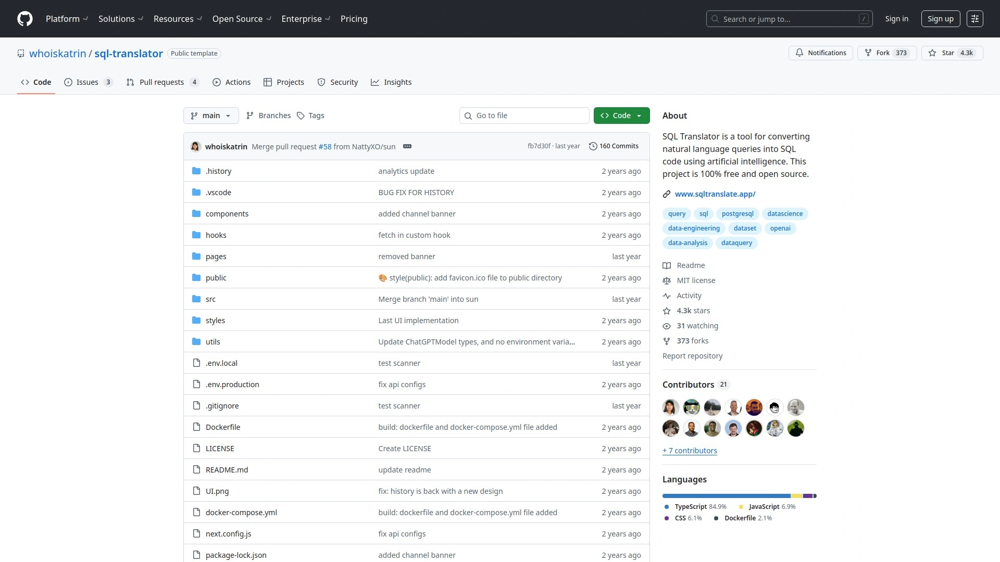

SQL Translator provides 100% free open-source solution for translating between SQL commands and natural language, working in both directions—natural language to SQL and SQL to natural language. The bidirectional capability distinguishes it from generation-only tools by also explaining existing SQL in human-readable format, valuable for learning and documentation. Features include dark mode, lowercase/uppercase toggle, copy to clipboard, SQL syntax highlighting, schema awareness (beta), and query history. GitHub repository with active community development ensures ongoing improvements and transparency about functionality. The open-source nature allows self-hosting without privacy concerns about sending queries to external services. Schema awareness beta feature improves accuracy by understanding your specific database structure. Reverse translation helps non-technical stakeholders understand what existing SQL queries do without reading raw code. Best for privacy-conscious users wanting self-hosted solutions, learners who benefit from seeing SQL translated to natural language for educational purposes, and developers wanting to customize and extend tool to specific needs. The free open-source model provides maximum flexibility and transparency impossible with commercial alternatives.

## **[dbForge AI Assistant](https://www.devart.com)**

Devart's AI coding assistant integrated with database development tools.

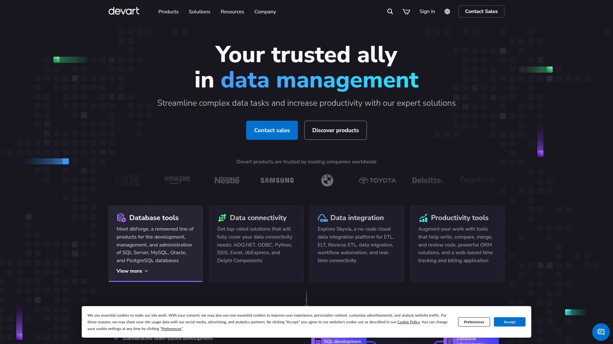

dbForge AI Assistant from Devart represents established database tools vendor's approach to integrating AI assistance into traditional database development workflow. Launched in 2025, the tool brings modern AI capabilities to developers already using Devart's database management products. Integration with existing dbForge toolchain provides seamless experience for current users eliminating need to switch between separate tools. Best for organizations already invested in Devart ecosystem wanting to add AI capabilities, database professionals comfortable with traditional development tools enhanced by AI assistance, and enterprises requiring established vendor support and integration. The integration approach differentiates it from standalone AI tools by embedding intelligence directly into familiar development environment.

## FAQ

**How accurate are AI-generated SQL queries compared to manually written ones?**

Top AI SQL tools like Text2SQL.ai and Defog.ai achieve 90-95% accuracy generating valid queries on first try when provided with proper schema context, matching or exceeding GPT-4 performance in specialized benchmarks. Accuracy improves dramatically when you include your database schema—tools understanding your specific tables, columns, and relationships produce ready-to-execute queries requiring minimal adjustments. Without schema context, expect 60-70% accuracy requiring more manual refinement. Most tools generate syntactically correct SQL consistently, with logic accuracy depending on how clearly you describe requirements.

**Can these tools handle complex queries with multiple joins, subqueries, and window functions?**

Yes, advanced AI SQL generators excel at complex queries including multi-table joins, nested subqueries, CTEs (Common Table Expressions), and window functions. Tools like BlazeSQL and Defog.ai specifically optimize for complex analytical queries businesses actually need rather than just simple SELECT statements. The AI handles complexity you'd typically spend hours researching in documentation. For best results with complex queries, break requirements into clear steps describing what data you need, how tables relate, and what calculations to perform. The learning mode in tools like AI2sql helps you understand generated complex queries, teaching advanced concepts through examples.

**Do I need to know SQL at all to use these tools effectively?**

No SQL knowledge required for basic queries—business users without any technical background successfully extract data using natural language descriptions of what they want. However, basic SQL understanding helps you evaluate generated queries for correctness and optimize results through better prompts. These tools excel at democratizing data access for non-technical users while also accelerating work for SQL experts who use them to handle routine queries quickly, focusing their expertise on truly complex problems. Think of AI SQL tools as dramatically lowering the skill floor while raising the productivity ceiling.

## Conclusion

Unlocking your database shouldn't require mastering decades-old syntax or waiting days for overloaded data teams. The AI SQL generators above deliver instant query creation spanning simple reports to complex analytics, with options for every use case from individual developers to enterprise deployments. [Text2SQL.ai](https://www.text2sql.ai) makes the most sense for most users because the 256,000+ satisfied users demonstrate proven reliability, schema-aware generation produces ready-to-execute queries without manual editing, and the comprehensive feature set covering generation, optimization, error fixing, and explanation provides complete SQL workflow support rather than just one piece of the puzzle. The combination of accuracy, ease of use, and completeness eliminates the friction preventing teams from accessing data they need for better decisions.
